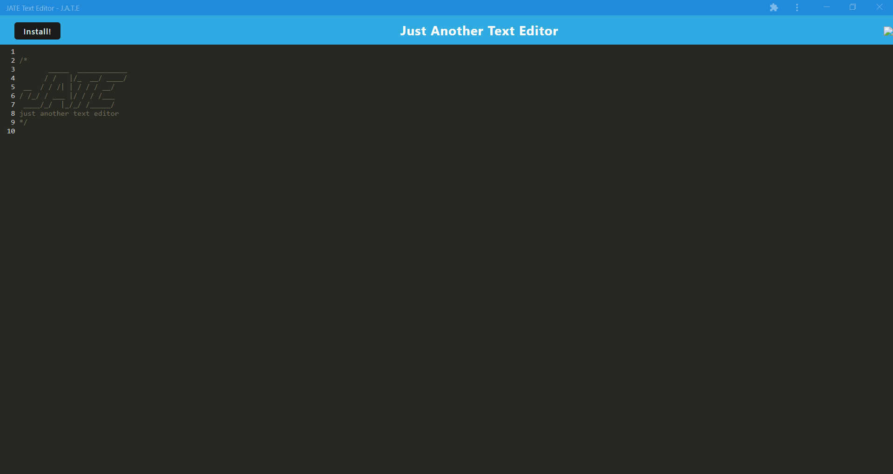

# Text-Editor

## Description

In this challenge, I added configuration and logic to the provided source code to meet all acceptance criteria so the text-editor application functions correctly given user interaction both inside and outside of the browser. Additionally, this web app has been deployed using Heroku.

## Screenshot

## Depoyed App Link

To view a video preview of the application, [CLICK HERE](https://warm-caverns-76004.herokuapp.com/).
